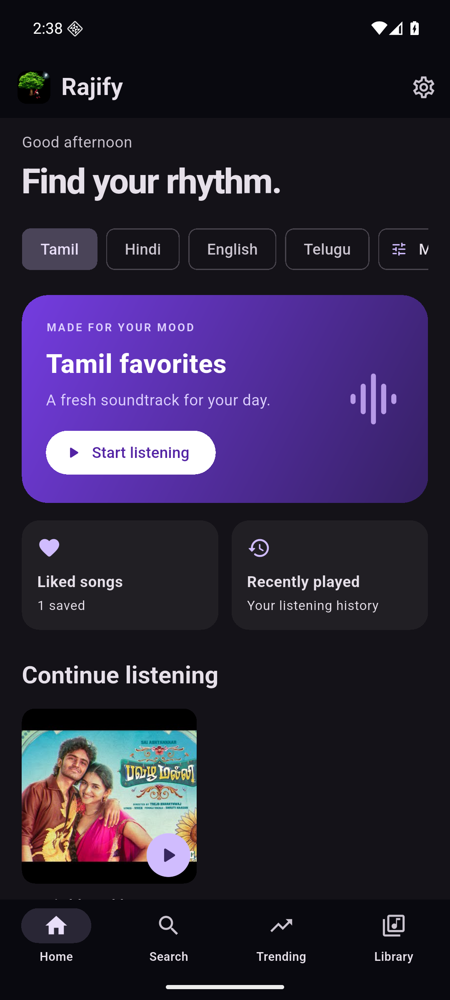
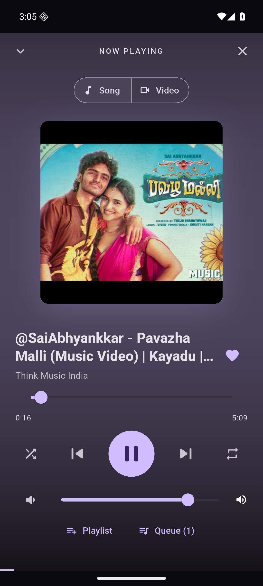
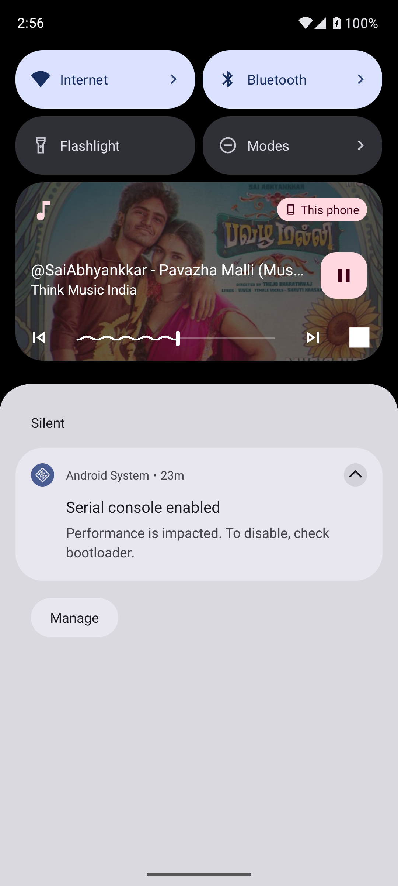

# Rajify for Android — Flutter

The native Android version of Rajify, alongside the React website and Electron Windows app. Application screens and state are Dart/Flutter; this does not load the Rajify website in a WebView. The sole embedded view is YouTube's official iframe player, provided by `youtube_player_iframe`.

<p>
  
  
  
</p>

## Features

**[Download the Android APK directly](https://github.com/rajeshravi2004/RajAudios/releases/download/flutter-v1.1.0-preview.2/rajify-android.apk)** (59 MB, Android 7.0+, no GitHub sign-in required).
The [mobile player preview](https://github.com/rajeshravi2004/RajAudios/releases/tag/flutter-v1.1.0-preview.2) includes a SHA-256 checksum and uses test signing.

- Native Material 3 interface with Rajify's violet theme, dark/light/device appearance, phone and landscape layouts.
- Discovery in all 20 languages supported by the website: trending songs, new releases, popular songs, playlists, history-based suggestions, and continue listening.
- Song/artist search, playlist search, recent searches, regional charts, pagination, loading/error/retry states, and music quality filtering.
- Local liked songs, playlist creation/rename/delete, visible add/remove actions, an Add songs search inside each playlist, duplicate prevention, saving loaded YouTube playlist songs, and bounded listening history.
- Song mode by default, a compact bottom player, an expanded artwork player, and an explicit Song/Video switch. Mode changes preserve the track, queue, and playback position.
- Persistent YouTube player across navigation, play/pause, previous/next, seek, mute/volume, shuffle, repeat-one/repeat-all, autoplay-next, likes, play-next, and a reorderable queue.
- Android foreground media service with notification, lock-screen, and headset playback controls, track metadata/artwork, and audio-focus/headphone-disconnection handling.
- Guest listening, Google OAuth through Supabase, persisted sessions, and cross-device preference sync using the existing `user_preferences` table and RLS policies.
- Owner user listing/pagination, individual deletion, and bulk deletion through the existing authenticated `/api/admin-users` endpoint. Every request is authorized on the server; owner deletion remains protected.
- Android Bluetooth and sound-settings shortcuts, session-only personal YouTube API key fallback, and local storage controls.

## Requirements & run

Use **Flutter 3.47.2 / Dart 3.13.2**, Java 17, and the Android SDK (platform 36, build tools, platform tools, and Flutter's NDK). Minimum Android version: **7.0 / API 24**. The checked-in Gradle project and lockfile make this an independently buildable Flutter app.

```bash
cd flutter
flutter pub get
flutter run --dart-define-from-file=config/production.json
```

`config/production.json` contains only the same public Supabase project URL/publishable key already exposed by the production website, the public API URL, and an owner email used for UI visibility. These are client configuration, not server credentials. RLS and server token checks enforce access. Never put a YouTube API key, Supabase secret/service-role key, or signing password in this JSON or a Dart define.

For another deployment, copy `config/example.json` to `config.local.json`, set its public values, and pass `--dart-define-from-file=config.local.json`. Omitting Supabase values enables guest-only mode. The API must provide the existing `/api/youtube` and `/api/admin-users` routes over HTTPS. No new database migration is required.

## Google sign-in setup

Use the same Supabase project and Google provider as the website. In **Supabase > Authentication > URL Configuration > Redirect URLs**, add this exact native callback:

```text
com.rajaudios.rajify://login-callback/
```

Keep the existing website redirects too. Google's OAuth client continues to use the Supabase HTTPS callback, not the Android custom scheme. Flutter launches the system browser and receives the PKCE callback through the Android intent filter. Supabase Flutter persists and refreshes the session. The callback allow-list is a deployment setting; merely building an APK does not update it. Verify login/logout and switching accounts on a real device before distributing to listeners.

The production project's native callback is configured. If Google sign-in opens RajeshOS or another website, check that this exact callback is still in the redirect allow-list: an unapproved redirect falls back to the shared project's Site URL. Preserve the other apps' URLs when adding it. This server setting takes effect for the existing APK; close the previous browser sign-in tab and start Google sign-in again from Rajify.

Callback routing was verified by starting Google OAuth and simulating cancellation: Supabase returned `com.rajaudios.rajify://login-callback/`. Completing Google account sign-in still requires a device/account check.

Preferences sync when signing in, changing settings, or pressing Sync in Settings. Failed sync preserves local changes and shows a retry status. As in the web app, libraries are local to the device; playlists/likes/history are not advertised as cloud-synced. The app does not upload listening history or personal YouTube keys.

## Build and download an APK

```bash
flutter build apk --release --dart-define-from-file=config/production.json
```

Universal APK (ARMv7, ARM64, x86_64):

```text
flutter/build/app/outputs/flutter-apk/app-release.apk
```

For smaller device-specific APKs, append `--split-per-abi`; most recent phones use `app-arm64-v8a-release.apk`.

The helper scripts run analysis/tests, build the APK, and copy it with a SHA-256 checksum into the repository's ignored `downloads/` folder:

```powershell
# From the repository root on Windows, with Flutter on PATH:
./flutter/scripts/build-apk.ps1
# Optional:
./flutter/scripts/build-apk.ps1 -SplitPerAbi -Config config.local.json
```

```bash
# macOS / Linux, from the repository root:
bash flutter/scripts/build-apk.sh
```

Transfer the APK to an Android phone and open it. Allow installation from the browser/file manager when Android prompts, then install Rajify. The app needs internet access to discover/stream music. APK download means downloading the app installer; Rajify does not download music files.

## GitHub APK builds & releases

The [Flutter Android APK workflow](../.github/workflows/flutter-apk.yml) runs for changes to Flutter on main and pull requests, and can be run manually once present on the default branch.

1. Open **Actions > Flutter Android APK** and select a successful run.
2. Download **rajify-android-apk** under **Artifacts** (GitHub sign-in required).
3. Extract the ZIP. It contains `rajify-android.apk` and `SHA256SUMS.txt`.

Artifacts expire after 30 days. With signing configured, pushing an `android-v*` tag publishes a permanent GitHub Release with the APK/checksum. Build numbers use the workflow run number. Increase the version in `pubspec.yaml` for new versions.

### Signing

Without `android/key.properties`, local builds and CI previews use a debug certificate. They are installable previews, not stable distribution builds; APKs produced on different machines can have different certificates and cannot update each other in place. Uninstalling clears local library data. Configure one persistent release key before general distribution and keep backups of it.

Generate a key using Java's `keytool` (prompts for passwords; keep it outside Git):

```bash
keytool -genkeypair -v -keystore /safe/path/rajify-release.jks -alias rajify -keyalg RSA -keysize 2048 -validity 10000
```

Copy `android/key.properties.example` to `android/key.properties` and fill the path, alias, and passwords. Both the properties and keystore files are ignored. The Gradle build automatically uses this key when configured.

For GitHub Releases, set these repository **Actions secrets**:

| Secret | Value |
| --- | --- |
| `ANDROID_KEYSTORE_BASE64` | Base64 contents of the same persistent release keystore |
| `ANDROID_STORE_PASSWORD` | Keystore password |
| `ANDROID_KEY_PASSWORD` | Signing key password |
| `ANDROID_KEY_ALIAS` | Signing key alias, e.g. `rajify` |

Tagged releases fail if any signing secret is missing. Pull-request builds never receive signing material. After merging and configuring signing:

```bash
git tag android-v1.0.0
git push origin android-v1.0.0
```

## Android platform differences

- All navigation, discovery, search, library, settings, and player controls are Flutter widgets. Song mode minimizes the embedded YouTube view; selecting Video displays it. Music continues while searching, switching apps, or locking the phone, using an Android foreground media service. Closing the player, signing out, or removing the task from recent apps stops playback. Playback still depends on internet access, YouTube availability, and Android battery/process management; it is not offline playback or a separate audio download.
- Android chooses the system audio output. Settings opens native Bluetooth pairing and sound settings. Dual Audio/LE Audio sharing depends on the phone and headphones. Electron's per-output volume, mono mixing, delay adjustment, and capture-based multi-device routing are not available here.
- Local likes/playlists/history are independent from the browser's IndexedDB. Signed-in **preferences** share the existing web schema. Sync is not a live collaborative editing system.
- Google OAuth, owner administration, audible playback, and Bluetooth need device/account/network validation. Automated tests do not claim real headset synchronization or replace signing into Google on a device.

## Validation

```bash
dart format --output=none --set-exit-if-changed lib test
flutter analyze
flutter test
```

Tests cover YouTube metadata/playlist IDs, filtering, queue reorder/remove/repeat/shuffle, library persistence and history limits, request deduplication/pagination, key routing and removal, quota/invalid responses, native guest/library navigation, and stale search response rejection. No tests delete real users or consume real account credentials.

All 14 Flutter tests pass, including small-screen/landscape player layouts, default Song mode, mode changes retaining playback state, notification commands, and playlist search/add/remove persistence. The universal release APK was installed on an Android 16 / API 36 emulator. Live playback continued while Android Settings was foregrounded and while the device was asleep; Android reported an active audio track, and lock-screen pause/resume advanced the actual playhead. Song/Video switching was checked in the installed APK. The screenshots above came from that app. Physical headset behavior and completing Google sign-in still need a device/account check.

Background playback uses the pinned Android WebView lifecycle patch in [`android/patches/webview_flutter_android/`](android/patches/webview_flutter_android/). Rebase it when upgrading that plugin; the Gradle build substitutes the patched source without modifying the Pub cache.

## Source layout

```text
lib/main.dart               App startup, theme, lifecycle, persistent shell
lib/models.dart             Tracks, playlists, settings, content filtering
lib/app_state.dart          Local persistence, OAuth, preference sync
lib/player_state.dart       Queue model and YouTube playback lifecycle
lib/services/music_api.dart Shared API, session-key fallback, cache, pagination
lib/services/background_audio.dart Android media session, notification and headset events
lib/ui/                     Native browse/library/settings/player screens
android/                    Android host, deep links, system settings, signing
config/                     Public build configuration
scripts/                    Checked APK build helpers
```

Package/platform references: [Flutter Android setup](https://docs.flutter.dev/platform-integration/android/setup), [YouTube player package](https://pub.dev/packages/youtube_player_iframe), and [Supabase Flutter](https://pub.dev/packages/supabase_flutter).
